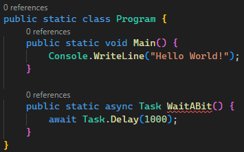
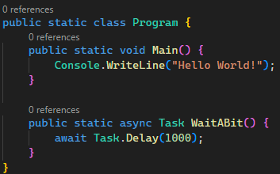

Reproduction of problem reported in https://github.com/microsoft/vscode-dotnettools/issues/61

Only the analyzer [RCS1046 Asynchronous method name should end with 'Async'](https://github.com/JosefPihrt/Roslynator/blob/main/docs/analyzers/RCS1046.md)
is enabled and should report on `Program.WaitABit`. WarningAsErrors is enabled to make it even clearer.

How it looks with old version of C# extension.

How it looks with C# Dev Kit extension.

